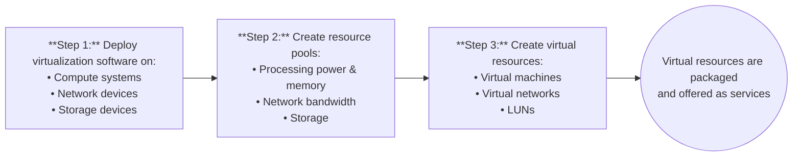

# Virtual Layer
This lecture talks about the virtual layer in significantly more detail than in [Lecture 2](https://github.com/DaraVaram/Cloud-Computing-Infrastructure/blob/main/Lecture-2.md).


Virtual layer is related to the elasticity and resource pooling. Recall the characteristics of the cloud: 
- Self-service
- **Elasticity** - Virtual layer focus
- **Resource Pooling** - Virtual layer focus
- **Multi-tenancy** - Virtual layer focus

## Introduction to Virtualization
Definition: Refers to the **logical abstraction** of **physical resources**, such as compute, network, and storage that enables a single hardware resource to support multiple concurrent instances of systems or multiple hardware resources to support single instance of system.

This is an enabler technology. No virtualization means that there is no cloud at all.

Virtualization allows resources to appear larger or smaller than they actually are. How? By turning them into logical units. This applies to both compute and storage. Imagine you have 6 machines with 2 CPU cores each. If you wrap them together and virtualize, your system appears to have 12 CPU cores now. Similar idea for storage as well. 

Enables a multi-tenant environment, improving utilization of physical resources.
- Parallel users of the same computer at the same time (as an example). This is the general philosophy.

### Benefits of Virtualization
- Optimizes **utilization** of IT resources
- Reduces **cost** and **management** complexity
- Reduces **deployment time**
- Increases **flexibility**

### Overview of the Virtual Layer
**Virtualized** compute, network and storage forms the virtual layer. This enables fulfilling two characteristics of cloud infrastructure: 
- Resource pooling
- Rapid elasticity

Multi-tenancy is not necessarily in-line with resource pooling. You can have a multi-tenant system without the need to pool resources, etc... Think about having the same compute node, with different ```conda``` environments on it. This is basically the same thing as virtualizing the machine. Everyone can have their own ```conda``` environment, but on the same machine (an A100). You **can** incorporate resource pooling (multiple A100s as part of a cluster), and allow rapid elasticity (adding more storage to the A100 cluster). 

_Do you need virtualization for multi-tenancy?_ You do not always need virtualization for multi-tenancy, as other methods like application-level and database-level isolation are also common. Virtualization is one method, especially useful when strong isolation is required, while application-level isolation is often used for cost-effective SaaS applications.

Specifices the entities operating at this layer: 
- Virtualization software
- Resource pools
- Virtual resources



### Compute Virtualization Software: Hypervisor
Definition: Software that is installed on a compute system and **enables multiple OSs** to run **concurrently** on a physical compute system.

Hypervisor Kernel: 
- Provides functionality similar to OS kernel
- Designed to run multiple VMs concurrently

Virtual Machine Manager (VMM): 
- Abstracts hardware
- Each VM is assigned a VMM
- Each VMM gets a share of physical resources.

This is summarized pretty well in the figure below: 


We can see that the VMM and is part of the hypervisor. The hypervisor **does not only manage the compute**. It manages the entire hardware that it's installed on. Otherwise, it wouldn't be able to virtualize that particular hardware. If you want to virtualize storage, you will need to hypervise the storage. 

| Types of Hypervisors | Description |
| ------ | ------- |

Does the hypervisor only manage the compute, or does it manage everything? 
