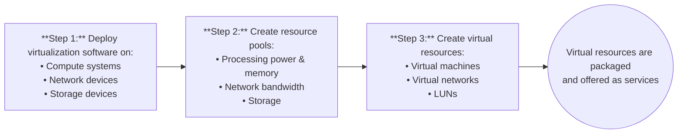

# Virtual Layer
This lecture talks about the virtual layer in significantly more detail than in [Lecture 2](https://github.com/DaraVaram/Cloud-Computing-Infrastructure/blob/main/Lecture-2.md).


Virtual layer is related to the elasticity and resource pooling. Recall the characteristics of the cloud: 
- Self-service
- **Elasticity** - Virtual layer focus
- **Resource Pooling** - Virtual layer focus
- **Multi-tenancy** - Virtual layer focus

## Introduction to Virtualization
Definition: Refers to the **logical abstraction** of **physical resources**, such as compute, network, and storage that enables a single hardware resource to support multiple concurrent instances of systems or multiple hardware resources to support single instance of system.

This is an enabler technology. No virtualization means that there is no cloud at all.

Virtualization allows resources to appear larger or smaller than they actually are. How? By turning them into logical units. This applies to both compute and storage. Imagine you have 6 machines with 2 CPU cores each. If you wrap them together and virtualize, your system appears to have 12 CPU cores now. Similar idea for storage as well. 

Enables a multi-tenant environment, improving utilization of physical resources.
- Parallel users of the same computer at the same time (as an example). This is the general philosophy.

### Benefits of Virtualization
- Optimizes **utilization** of IT resources
- Reduces **cost** and **management** complexity
- Reduces **deployment time**
- Increases **flexibility**

### Overview of the Virtual Layer
**Virtualized** compute, network and storage forms the virtual layer. This enables fulfilling two characteristics of cloud infrastructure: 
- Resource pooling
- Rapid elasticity

Multi-tenancy is not necessarily in-line with resource pooling. You can have a multi-tenant system without the need to pool resources, etc... Think about having the same compute node, with different ```conda``` environments on it. This is basically the same thing as virtualizing the machine. Everyone can have their own ```conda``` environment, but on the same machine (an A100). You **can** incorporate resource pooling (multiple A100s as part of a cluster), and allow rapid elasticity (adding more storage to the A100 cluster). 

_Do you need virtualization for multi-tenancy?_ You do not always need virtualization for multi-tenancy, as other methods like application-level and database-level isolation are also common. Virtualization is one method, especially useful when strong isolation is required, while application-level isolation is often used for cost-effective SaaS applications.

Specifices the entities operating at this layer: 
- Virtualization software
- Resource pools
- Virtual resources



### Compute Virtualization Software: Hypervisor
Definition: Software that is installed on a compute system and **enables multiple OSs** to run **concurrently** on a physical compute system.

Hypervisor Kernel: 
- Provides functionality similar to OS kernel
- Designed to run multiple VMs concurrently

Virtual Machine Manager (VMM): 
- Abstracts hardware
- Each VM is assigned a VMM
- Each VMM gets a share of physical resources.

This is summarized pretty well in the figure below: 


We can see that the VMM and is part of the hypervisor. The hypervisor **does not only manage the compute**. It manages the entire hardware that it's installed on. Otherwise, it wouldn't be able to virtualize that particular hardware. If you want to virtualize storage, you will need to hypervise the storage. 

| Types of Hypervisors | Description |
| ------ | ------- |
|Bare-metal | <ul><li>Installed on a bare-metal HW</li><li> Requires certified HW</li><li> Suitable for enterprise data centers and cloud infrastructure </li></ul>
| Hosted | <ul><li>Installed as an application on an OS </li><li> Relies on OS running on physical machine(s) for device support </li><li>Suitable for development testing and training purposes.</li></ul>

Hosted: would be something like having a virtual box and then installing Linux onto your PC using that virtual box. That's what hosted is. 

Bare metal: The hypervisor will be installed directly onto the machine prior to any OS. There's no OS in between the hypervisor and the machine. It's as if it's the OS, and now, on top of this, you can have multiple VMs installed. There are some minimum requirements for installation. The figure in the last section is an example of bare-metal. Example: ESXI. 
- To access bare-metal hypervisor: You have an IP address, use the console to create VM

If you have hosted, then there would be a **layer of OS** between the physical resources and the hypervisor. 


### Network Virtualization Software
Abstracts physical **network** resources to create virtual resources. This allows VMs to talk to each other, and also isolates the traffic. 
- Virtual LAN / Virtual SAN
- Virtual Switch

Network virtualization software can be: 
- Built into the operating environment of a **network device**
- Installed on an independent **compute system**
    - Fundamental component for deploying software-defined component.
- Hypervisor's capability


### Storage Virtualization Software
Abstracts physical **storage** resources to create virtual resources. 
- Virtual volumes
- Virtual disk files
- Virtual arrays


Storage virtualization software can be (This is the exact same thing as above, just switch network with storage): 
- Built into the operating environment of a **storage device**
- Installed on an independent **compute system**
    - Fundamental component for deploying software-defined component.
- Hypervisor's capability

**Example:**

If you have a server that has compute, storage and network, you can virtualize all of it. The two ways of doing this is either we virtualize the entire thing and all of its components on an independent compute system, or we can just do the Azure thing which is where we get a virtual disk that's already virtualized and use that immediately. This is what we mean by it being built into the operating environment of a storage device. 


## Resource Pooling
Definition: A **logical abstraction of the aggregated computing resources**, such as  processing power, memory capacity, storage, and network bandwidth that are managed collectively. **Very important:** Everything before this, we abstract / virtualize first, and then aggregate. For resource pooling, we have a pool of resources that are not inherently abstracted together. So then we aggregate them and _then_ we virtualize again. 

You have separate hard drives. Now, you put the hard drives in a box to "abstract" them, and then you put them into a bigger box to aggregate and virtualize. Abstracting the abstracted resources. You can increase the size of the resource pool as well. Then, you can assign the resources based on the users' needs. 


Cloud services obtain computing resources from the resource pool. They are **sized** according to **service requirements**.
- Resources are **dynamically allocated** as per consumer demand

Another example: 


Each one of the resources here has their own hypervisor, meaning that it's already virtualized. Now, we group them together and virtualize again, and then you create virtual machines. You connect them to each other. This aggregation method is a software (hypervisor), or it could be a networking thing. They are networked together for sure.


This is an example for a block-based storage system. This is only for one system. We are pooling resources into a single storage system. In this example, there is no computer. It's just storage drives pooled together. We obviously need the storage controllers (something has to manage it), but it's not a computer. If we want to extend this across storage systems: 


We have a higher level of abstraction, where we are basically pooling the resource pools of storage. 

### Network Pooling


This is what happens when you do network pooling. This pool has three NICs. We are pooling the bandwidth (technically the NICs). Then, you allocate to the consumers based on how much they need / want. This is called **teaming** the NICs. 

## Virtual Machines (VMs)
Definition: A logical compute system that, like a physical compute system, runs an OS and applications.

This is **created by a hypervisor and is installed on a physical compute system**. This hypervisor can be either bare-metal or hosted, but the VM is installed specifically on top of the hypervisor. It comprises of the virtual HW, such as virtual processor, memory, storage, and network resources. 
- **Appears as a physical compute system** to the guest OS
- Hypervisor **maps** the virtual HW to the physical HW
- Provider provisions the VMs to consumers for deploying applications
    - VMs on the same **compute system** or **cluster** run in **isolation**. Basically, the people that are using different VMs on the same compute system / cluster will not feel the impact of the others on that cluster. This is unless you network them with each other.
 
### VM Files
From the hypervisor's perspective, the VM is a discrete set of files.

| Files | Description | 
| ---- | ----- |
| Confirguation File | <ul><li>Stores information such as the VM name, BIOS information, the guest OS type, and memory size</li></ul> | 
| Virtual Disk File | <ul><li>This stores the contents of the VM's disk drive</li></ul> | 
| Memory State File | <ul><li>This stores the memory contents of a VM in a **suspended** state </li></ul> | 
| Snapshot File | <ul><li>Stores the VM settings and virtual disk of a VM </li></ul> | 
| Log File | <ul><li>Keeps a log of the VM's activity and is typically used in troubleshooting </li></ul> |

### File system to manage VM Files
Hypervisor's native file system: 
- Clusted file system deployed on local or external storage
- Enables **multiple hypervisors** to **perform concurrent reads and writes**
- Enables high availability to protect against hypervisor or compute system failures

Shared File system: 
- Enables storing VM files on remote file servers or NAS devices


In this figure, you can see that the hypervisors can write and read their data to this shared file system. 

### VM Console
This is an interface to view and manage VMs on a compute system or a cluster. VM console may be: 
- Installed locally on a compute system
- Web-based
- Accessed over a remote desktop connection.

It's used to perform activities such as: 
- Installing a guest OS and accessing VM BIOS
- Powering a VM on or off
- Configuring virtual HW and troubleshooting

### VM Template
Definition: A master copy of a VM with **standardized virtual hardware and software configuration** that is used to **create new VMs**.

It is created in two ways: 
1. Converting a VM into a template
2. Cloning a VM to a template

Steps involved in updating a VM template are: 
1. Convert the template into a VM
2. Install new software / OS / software patches
3. Convert the VM back to a template.

Basically, from the template, create the VM, update stuff, and then make it a template again. What's the difference between a VM and a container? Containers are more lightweight. It's not necessarily a full OS, could just be the applications you need, etc...


### Virtual Appliance
Definition: **Preconfigured** virtual machine(s) **preinstalled with a guest OS** and an **application dedicated to a specific function**.

What's the difference between a template and an appliance? One of them is customizable. Appliciances are constrained. You can get a VM for a firewall. That's an appliance. You can't do whatever you want with it. It's only for that application. A template can literally be whatever. 

Used for functions such as: 
- Providing SaaS
- Routing packets or deploying a firewall

Simplifies the delivery and operation of an application. It also simplifies the installation process and eliminates configuration issues. The application is protected from issues in other virtual appliances. They're all independent. 
- You can create this using the **Open Virtualization Format (OVF)**.

### VM Network
Definition: A **logical network** that provides **Ethernet connectivity** and enables communication between VMs **within a compute system**.

A logical abstraction of the network interface. 


What do we see in this figure? On the left and right side, we have separate compute systems. Each one has a VM network, which connects the different VM instances in each compute system. They can communicate with each other through the NICs. 

### VM Network Components

| Component | Description |
| --- | ---- | 
| Virtual Switch   |   <ul><li>A logical OSI Layer 2 Ethernet switch created **in a compute system**</li><li>Connects VMs locally and also directs VM traffic to a physical network </li><li> **Forwards frames** to a virtual switch point based on destination address</li><li>A distributed virtual switch can function across multiple physical compute systems</li></ul> |
| Virtual NIC |  <ul><li>Connects a VM to a virtual switch and functions like a physical NIC </li><li>Has unique MAC and IP addresses </li><li>Forwawrds the VMs' network I/O in the form of Ethernet frames to the virtual switch</li></ul> | 
| Uplink NIC | <ul><li>A physical NIC connected to the uplink port of a virtual switch</li><li>Functions as an ISL (inter-switch link) between virtual and physical switches</li></ul>

## Logical Number Unit (LUN)
Definition: **Abstracts the identity and internal functions** of **storage system(s)** and **appear as physical storage** to the compute system.

Mapping of virtual to physical storage is performed by the virtualization layer. The provider provisions LUN to consumers for storing data. 
- Storage capacity of a LUN can be dynamically expanded or reduced

LUN can be created from: 
1. RAID set (traditional approach)
2. Storage pool


There's two types of volumes that are created from storage pools: 
1. Thin LUN
- **Does not require** physical storage to be completely allocated at the time of creation
- **Consumes storage as needed** from the underlying storage pool in increments called **thin LUN extents**.

2. Thick LUN
- Physical storage is **completely allocated** at the time of creation.

Thin LUN: It's basically not completely reserved for you. It's based on usage. You only provision what you need to store. Some issues here: For example, latency, or what if all the thin LUNs are consumed already? It's also apparently a security vulnerability. There's a potential problem of data leakage. You might be using someone else's allotted space. 

Thick LUN: If you reserve a full 1TB, you will be charged for it whether you use it or not. This is the same thing with Azure. If I want a 1TB LUN, then I will be charged for that, not for whatever I use. 

### Use of Thin LUN
They're appropriate for applications that can **tolerate performance variations**.
- In some cases, performance improvement is seen when using a thin volume due to striping across a large number of drives in the pool. Basically, instead of one huge storage space, we have them striped (RAID), which speeds things up.

Environments where cost, storage utilization, space and energy efficiency is super important. For applications where storage consumption and space requirements are difficult to forecast. You pay-as-you-go. Also appropriate for environments that needs to be optimized for self-provisioning. What does this mean?
- Self-service or fast provisioning environments. The space needs to be allocated automatically based on usage.


## Virtual Network 
Definition: A **software-based logical network** that is either a **segment of a physical network** or spans **across multiple physical networks**.

Appears as a phyiscal network to the connected nodes. Virtual networks share network components **without leaking information** between them (**isolation** of traffic). Network traffic is routed _only_ when two nodes in different virtual networks are communicating. 
- All types of networks can be virtualized, such as compute networks, SANs and VM Networks. 


There are two virtual switches. They segment traffic between these two sets of VMs. Each vertical strip is a virtual network. They can have VMs across different compute systems, connected in the same virtual network. 1 and 3 are in the same virtual network. 

The VMs are connected to virtual switches, which are routed to the physical switch through a physical NIC. What does the IP router does here? It's there if you want to go outside of the local network(s). All this can be seen as being in the same data center. 

Types of virtual networks: 
- Virtual LAN (VLANs)
- Private Virtual LAN (PVLANs)
- Stretched VLAN
- Virtual SAN
