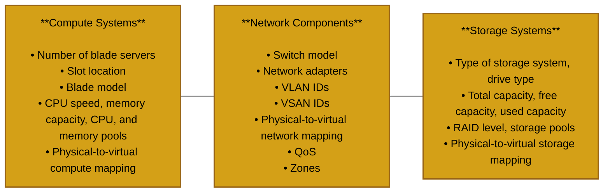
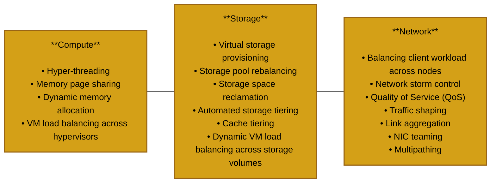

# Control Layer
Definition: Includes software tools that are responsible for **managing** and **controlling** the underlying cloud infrastructure and **enables provisioning of IT resources** for creating cloud services. 

The control can be deployed on top of the virtual layer or on top of the physical layer. It receives requests from the service and orchestration layers, and then provisions the required resources to fulfill the service requests. Key functions of the control layer are: 
- Resource configuration
- Resource provisioning
- Monitoring resources

It's in between. It takes requests from above, and makes sure that the resources below are able to provide. It's the **line manager** of the cloud stack.

## Control Software
This lives inside the control layer. Ties together the underlying resources and works in conjunction with virtualization software to enable: 
- Resource **pooling** (It does not do the actual resource pooling, it just "sends the green flag" to go ahead. The virtual layer is what actually does it)
- **Dynamic** allocation of resources for services
- Optimizing **utilization** and the operation of resources

This provides a **complete view** of all the resources in the cloud environment. 
- Enables **centralized management** of IT resources.

There's 2 types of control software: 
1. Element manager
2. Unified manager

## Element Manager
Infrastructure component vendors may provide the element managers as built-in _or_ external software. It is required to manage infrastructure compoenents independently. There is going to be a question on the exam about this. It is a amanger for a specific resource, such as compute, storage, or network.  

What does the figure tell us? We have three different EMs, they each go through an API, and then they handle whatever it is that they're supposed to handle. Keep in mind that this is in the control layer. We **get access** to the virtual layer through the API. 

### Key tasks performed by the EM
1. Enables performing **initial component configurations** and allows modifications to it. For example, installing guest OS, configuring zoning, security settings, VLANs, RAID, etc...
2. Allows **expanding** resource capacity (detects newly added resources and adds them to an **existing pool**)
3. Monitors the infrastucture component for performance, availability, capacity and security.

## Unifed Manager (UM)
Provides a **single management interface** for configuring and provisioning resources for applications and services. We no longer have a breakdown into specific elements / resources. It's all-in-one inclusive. 

To coordinate the different EMs together, we have the UM on top, which communicates with the EMs using API. The unified manager manages the element managers. It's sort of like a delegation thing. 

- Exposes APIs that can be integrated with the orchestration layer (to the layer above) to **automate service provisioning**. You will get a request from orchestration layer. The UM gets it, talks to the designated EM through APIs, which then takes the request to the layers underneath.
- Enables **adding or removing infrastructure** resources to an **already-provisioned** service
- Performance **compliance checks** during resource configurations
- Provides a **dashboard** showing **resource configurations** and **utilization**. This could be a trick question, because someone might think that having a dashboard means it's in the service layer.
    - Allows administrator to perform monitoring, reporting, and root-cause analysis.

## Key Phases for Provisioning Resources
1. Resource Discovery (Identifying the available **resources**)
2. Resource Pool Management (Aggregate them to make a pool)
3. Resource Provisioning (This is just giving the resources)

Before we do any of this, you will need to create the virtualized resources based on the available physical resources. We are assuming that resources are already virtualized, since this lecture focuses on the control layer only. 

### Resource Discovery
Enables UM to learn about the resources that are available for service deployment
- Provides visibility to each resource
- Enables managing cloud infrastructure resources **centrally**. What do we mean by centrally here? Basically, just centralizing the management of resources. There is a single point of control over the resources.

Note: QoS is networking. You need to check the router using the Ethernet cables, you can configure the QoS. Prioritize certain traffic to go to certain devices, etc...

### Resource Pool Management - Grading Pools
Instead of grading, we can also consider it as different tiering of the storage. 

The UM allows to grade pools: 
- Categorizes resources and identity pools based on pre-defined criteria
- Helps creating a variety of services, providing choices to consumers

Multiple grade levels (Gold, Silver, Bronze) can be defined for each type of pool. Costs and prices of resource pools differ depending on this grade level. 

| **Grade** | **Description** |
|------------|-----------------|
| **Gold** | Includes Flash, FC, and SATA drives, supports automated storage tiering, capacity **3 TB** (Flash 1 TB, FC 1 TB, SATA 1 TB), and **RAID level 5**. |
| **Silver** | Includes Flash, FC, and SATA drives, supports automated storage tiering, capacity **3 TB** (Flash 0.5 TB, FC 1 TB, SATA 1.5 TB), and **RAID level 1+0**. |
| **Bronze** | Includes FC drives, capacity **2 TB**, **RAID level 5**, and does **not support automated storage tiering**. |

These are just examples, it's not the standard. Why is it necessary to have these tiers?
- If we have a flat **hierarchy**, this would increase the complexity in terms of the _best_ allocation of resources
- If we have these tiers / grades, we only look at a specific cluster of resources. We are limiting the search space of what we can give to the user.

### Resource Provisioning
Definition: Involves **allocating resources** from **graded** resource pools to the **service instances**.

Provisioning starts when consumers select cloud services from the service catalog (which is in the service layer), and then it gets passed down to the orchestration and control layer. A service template defined in a service catalog facilitates the consumers to understand the service capabilities. 
- Resources are allocated and configured as per the service template to create an instance of the server.

We've heard of the term templating from the virtual layer lecture. It's going to be a different template, but the concept is the same. These are for services specifically, but in the virtual layer lecture, we looked at VM templates. 

## Software-Defined Approach
Abstracts the underlying infrastructure components. Separates the management functions from the infrastructure components to the external SW that runs on a controller. 
- Enables controlling IT infrastructure centrally

What's the difference between this and EM / UM? There's no delegation here. The application goes directly to the software-defined elements. The application is the UM. The application goes through an API, which goes through a controller, which then executes things. This is **hardware-agnostic**.

### Key Functions of Software-Defined Controllers
Discovers underlying resources and provides an aggregated view of them. This means that we abstract the underlying hardware resources (compute, storage, network) and pools them. 
- Enables rapid provisioning of resources based on pre-defined policies (This is a fully automated process)
- Enables applying policies uniformly across infrastructure components, all from a SW interface
- Provides interfaces that enable applications external to the controller to request resources and access them as services

## Resource Management
Definition: Process of **allocating** resources **effectively** to a service instance from a pool of resources and **monitoring** the resources that help in **maintaining service levels**.

This is basically allocation + monitoring, you don't just want to allocate, you also want to be able to monitor how your allocated resources are doing. 

Key goals of resource management: 
- Controls utilization of the resources
- Prevents service instances from monopolizing the resources (The service instance won't just hog the resources by itself entirely)

The **management server** is used to centrally manage the resources. 
- Enables defining policies
- Configures and monitors the resources
- Provides the ability to pool the resources

There is a consumer and vendor side to resource management. There might be some minimum energy constraints, this could destroy the SLA. We need some sort of multi-objective approach to cater to both consumers and providers (to meet both their needs). 

### Resource Allocation Models

| Model | Description | 
| ---- | ----- | 
| Relative Resource Allocation | Resource allocation to a service instance is defined proportionally relative to the resource allocated to other service instances. What does this mean? There's no guarantee of lower or upper bounds for the resource allocation. It's all relative to the usage basically across multiple consumers. 
| Absolute Resource Allocation | Resource allocation for a service instance is based on defining a **quantitative bound**. The lower bound guarantees a minimum amount of resources, and the upper bound **limits** a service instance from consuming resources beyond the defined maximum level | 

This is from the SLA. The consumer pretty much has no say, because the vendor already does subscription tiers. There's supposed to be a guarantee based on this.

## Key Resource Management Techniques

We'll discuss some of the techniques in a bit. 

### Hyper-threading
Makes a processor appear as 2 logical processor cores. This enables an OS to schedule 2 threads simultaneously. There's 2 logical processor cores that share the same physical resources. 
- While the current thread is stalled, the processor can execute another thread. This provides improved performance and utilization.

This is basically just saying that there's 1 physical core that acts like 2 logical cores. The analogy is 2 drivers sharing the same car. One driver sleeps while the other one drives, they need to schedule accordingly so that they best utilize their resources. 

What's the difference between this and multi-threading? Multi-threading is multiple threads from a program running concurrently to perform parallel tasks. The analogy is a _team of drivers_ driving their own cars on the same road. There's a clear difference here. 

### Memory Page Sharing
The entire VM is broken down into memory pages. This is a very important concept. Everything about the VM is stored as memory pages. The VM files are broken down into memory pages and that's what's stored. 

Eliminates redundant copies of memory pages. This allows a greater degree of memory over-commitment. What does this mean? It means the hypervisor allocates more virtual memory to VMs than the total physical RAM actually available on the host. In simpler terms, the total **promised memory** is greater than the actual physical memory. For example, you can allocate 32GB to a VM even though the machine only has 16GB. How does this work? Sort of like overbooking flights. 

The hypervisor identifies redundant pages to some point, and then the VM memory pointer is updated to point to shared location. 
- Redundant memory pages are reclaimed.

We have some shared memory page, if other VMs do something similar then they can just share it, instead of having their own copy of it basically. Think about weight sharing in neural networks. Why is there a private copy? If you make a change, then you'd have your own copy, not necessarily the shared copy that others have access to as well. 

### Dynamic Memory Allocation
This is a memory optimization technique that reclaims memory pages. VMs have agents installed in guest OS that communicates with the hypervisor. When the memory becomes scarce: 
- The agent in a VM demands memory from the guest OS
- The guest OS allocates memory pages to the agent
- The agent reserves the memory and puts it back into the memory pool
- The hypervisor then assigns the released memory to other VMs that require the memory. You need to consider that other VMs are there as well, so they release it so that you can reclaim and use for your VM instance.

### VM Load Balancing Across Hypervisors
Allows us to provide **uniform distribution** of **load** across hypervisors. Key processes involved in balancing VM load: 
- **Management server** checks the **availability** of resources on all hypervisors when a **new VM is powered on**.
- Management server places the VM on a hypervisor with sufficient resources, and ensures that the load is balanced.
- Management server monitors the load across hypervisors
    - If there is any imbalance, then the server balances the load by migrating from over-utilized to under-utilized hypervisors. This **can** be live migration.
 
## Virtual Storage Provisioning 
Definition: It enables to present a **LUN** to an application with **more capacity** than is **physically allocated** to it on the storage system.

Physical storage is allocated to the application on-demand. This provides more efficient utilization of storage, and reduces storage cost. Also simplifies storage management. 

Recall the two types of LUNs: 
1. Thin
2. Thick

The figure shows the process of creating LUNs out of the storage pool. Then, the LUN is assigned to the compute system. As you can see, they're told they're getting 10TB, but they're actually getting 3, 4 and 3TB. Since these are thin LUNs, it will keep expanding as you use it. 

### Storage Space Reclamation
What happens here is the following: We identity the **unused space** in **thin** LUNs and **re-assign it** to the storage pool. This provides cost savings. 
- Options to reclaim the unused space on a thin LUN:
    - **Zero-extent** reclamation: De-allocate storage extents that contain all zeros in a thin LUNs. These are then added back to the pool. This is the common one. 
    - API-based reclamation: API communicates the location of all the identified unused space on the LUN to the storage system to reclaim all unused space to the pool.

What's the difference between the two? API one is more accurate. The zero-extent just looks for 0s, which does not necessarily cover all the unused space. The API one checks more thoroughly. 

### Storage Pool Rebalancing
Provides the ability to rebalance allocated extents on physical disk drives over the pool when **new** drives are added. Accordingly, we have to **restripe** the data across all the disk drives in the shared storage pool. This helps in achieving higher overall **pool performance**.
- Enables spreading out the data equally on all the drives within the pool. Ensures that the used capacity of each drive is **uniform** across the pool.

## Automated Storage Tiering
Definition: A technique of establishing a **hierarchy** of different storage types for different **categories of data** that enables storing the **right data** automatically to the **right tier**, to meet the service level requirements.

This is **automated**. Each tier has different levels of **protection**, **performance** and **cost**. Data is moved between tiers based on **defined tiering policies**.
- Tiering policy is usually based on parameters such as file type, frequency of access and so on.
- Data movement occurs between tiers within a storage array (intra-) and between storage arrays (inter-).

### Cache Tiering
Enables creation of a large capacity of **secondary cache** using **SSDs**. We have the primary cache (DRAM) and then this, which is SSD. Enables tiering between DRAM cache and SSDs. **Most reads** are served directly from high-performance **tiered cache**. Key benefits: 
- Enhances performance during peak workloads
- Non-disruptive, and transparent to applications.

Recall that the cache is for frequently accessed data. 

### Dynamic VM Load Balancing Across Storage Volumes
Enables intelligent placecment of VMs **during creation** based on the I/O load and available storage capacity on the volume. This obviously improves the performance. 
- Management server performs on-going load balancing within a cluster of volumes.
    - Cluster volume is a collection or pool of volumes that are aggregated as a single volume. This enables efficient and rapid placement of new VMs.
 

## Network Traffic Management
Network traffic flow is controlled and managed to optimize the performance and availability of cloud services. Key network traffic management techniques are: 
- Balancing client workload across nodes
- Network storm control
- Quality of Service (QoS)
- Traffic shaping
- Link aggregation
- NIC teaming
- Multipathing

### Balancing client workload across nodes
Splits the client workload across multiple nodes. It's usually performed by a **purpose-built** device called a **load balancer**. This is a physical piece of hardware. The load balancer is placed between the node cluster and the internet. 
- It decides **where to forward** each request

What does this figure show? It goes back and forth. The traffic that comes from the internet can be assigned / sent to different switches. This kind of looks like a neural network actually. 

### Quality of Service (QoS)
Definition: Capability of a network to **prioritize business critical** and **latency-sensitive** network traffic and to provide better service to such traffic over less critical traffic. QoS enables applications to obtain **consistent service levels** in terms of network bandwidth, latency variations, and delay.

| Approach | Description | 
| ----  | -----  |
| Integrated Services | The application signals the network to inform network components about the required QoS. This is like a deadline. The application can transmit data through the network only after receiving confirmation from the network. 
| Differentiated Services | Priority specification to network packets are inserted by applications or by switches or routers. The network uses priority specification to classify traffic and then manage network bandwidth based on the traffic class. 

- Integrated: Examples are video and voice. The delay must be minimal. You are guaranteed a service here. 
- Differentiated: Packets are tagged with priority levels. Routers / switches handle them differently based on those tags. Bulk data transfers, etc... This is simpler and scalable, but no strict guarantees.

### Traffic Shaping
Limits the traffic rate at a network interface such as a node port or a router port. If the traffic rate exceeds the pre-configured limit, traffic shaping **queues excess packets** for later transmission.
- Ensures required service levels for business-critical applications
- Controls the traffic rate for client / tenant to avoid network congestion.

We provide a specific rate of bandwidth over time for this.

This figure basically explains the entire idea. 

### Link Aggregation, NIC Teaming, and Multipathing

**Link Aggregation**:
- Combines links between 2 switches, and between a switch and a node.
- Enables distribution of network traffic across links in the aggregation. 

**NIC Teaming**:
- Distributes network traffic across NICs
- Provides network traffic failover in the even of a NIC / link failure

**Multipathing**:
- Provides load balancing and path failover
- Improves I/O performance and data path utilization
